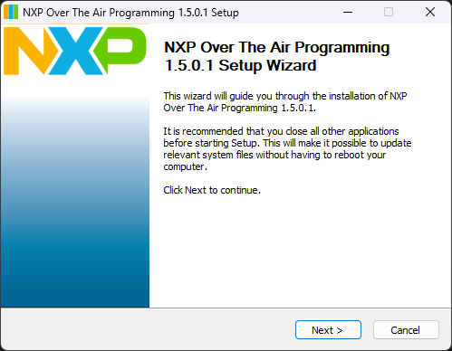

# NXP Over The Air Programming Tool

This is the main documentation page for the Over The Air Programming Tool from NXP. 

The gif below illustrates the typical workflow for the plain binary over-the-air transfer:

## About this tool
NXP Over-The-Air Programming (OTAP) is a Windows-based graphical interface utility that communicates via
a serial interface to NXP development boards. The application aggregates over-the-air (OTA) updates for different
protocols:
* IEEE 802.15.4 MAC
* Thread
* Bluetooth Low Energy
* Zigbee
* Matter

This application wirelessly updates the firmware of an NXP board supporting either one of the above
mentioned protocols.

# Table of Contents
1. [Requirements](#requirements)
2. [Installation and Quick Start](#installation-and-quick-start)
3. [License](#license)
4. [First steps](first-steps.md)
5. [Bluetooth Low Energy](bluetooth-le.md)
   * [Encrypted transfers using `.sb3` container](encrypted-bluetooth-le.md)
     * [JSON files configuration details](encrypted-bluetooth-le.md#json-files-configuration-details)
   * [Plain binary transfers](plain-bin-transfers-bluetooth-le.md) 
6. [Matter](otap-matter.md)
   * [JSON files configuration details](otap-matter.md#json-files-configuration-details)
7. [Zigbee](otap-zigbee.md)
   * [Create an `.ota` file from `.axf`](zigbee-create-ota-from-axf.md)
      * [nxpzbota](zigbee-create-ota-from-axf.md#nxpzbota)
      * [JSON files configuration details](zigbee-create-ota-from-axf.md#json-files-configuration-details)
   * [`.ota` file transfer](zigbee-ota-file-transfer.md)
     *  [Flashing the demo applications onto the boards](zigbee-ota-file-transfer.md#flashing-the-demo-applications-onto-the-boards)
8.  [Thread](otap-thread.md)
9.  [MAC 802.15.4](otap-mac-802-15-4.md)

## Requirements 

1. Windows 10 or above
2. Microsoft .NET Framework 4.8 Runtime
3. Microsoft Visual C++ Redistributable Package (x86)
4. Serial Virtual COM drivers are required

## Installation and Quick Start

__The application is available on the [NXP Connectivity Tool Suite webpage](https://www.nxp.com/design/design-center/development-boards-and-designs/general-purpose-mcus/connectivity-tool-suite:CONNECTIVITY-TOOL-SUITE?tab=Design_Tools_Tab).__

1. Launch the installer and, optionally, the Connectivity Tools Launcher
that comes bundled with it.
2. Optionally, install the Arm GNU Toolchain for Windows. The GNU toolchain is used for transforming an `.axf` file into an `.ota` file used in the Zigbee protocol case.
3. Choose the install location.

# License
Over-The-Air Programming Tool is released under the [NXP Software License Agreement](https://www.nxp.com/docs/en/disclaimer/LA_OPT_NXP_SW.html).