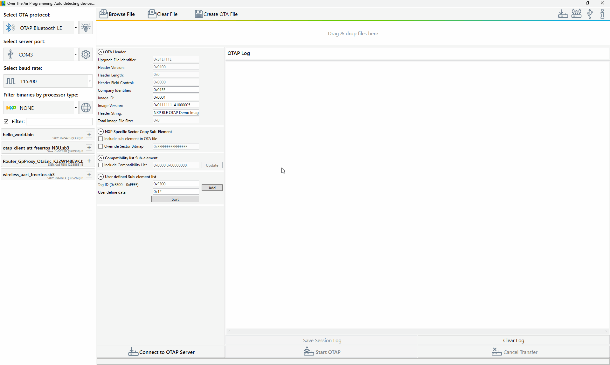
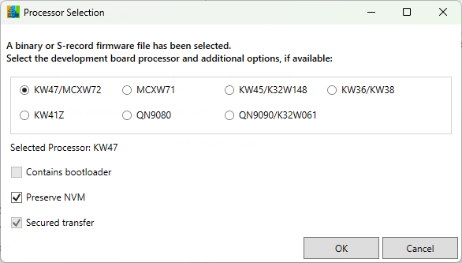
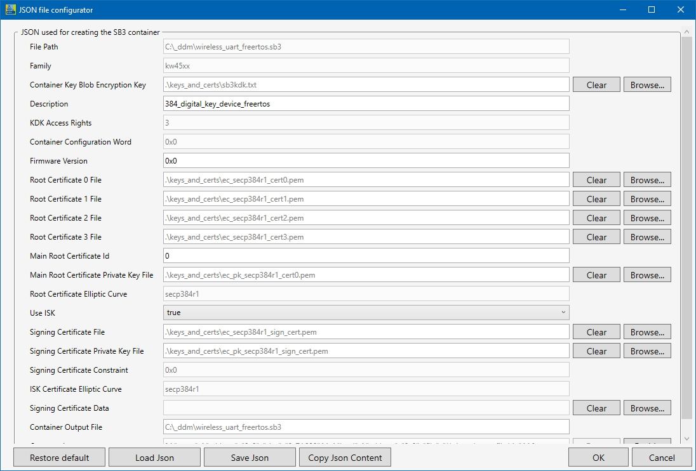

## Encrypted transfers using `.sb3` container
> [!IMPORTANT]  
> When attempting to transfer a secured `.sb3` file OTA on a KW47-EVK, KW47-LOC, FRDM-MCXW72 or MCXW72-EVK client, ensure you have the ROKTH and SB3KDK keys burnt in the `CUST_PROD_OEMFW_AUTH_PUK` and `CUST_PROD_OEMFW_ENC_SK` fuses on the client. Otherwise, the client rejects the secured file.

For a short demo of the application, watch the gif below:

**Before attempting an OTA transfer, familiarize yourself with the boards using [_IAR Embedded Workbench IDE_](https://mcuxpresso.nxp.com/mcuxsdk/latest/html/boards/Wireless/k32w148evk/gettingStarted/topics/running_a_demo_application_using_iar.html), [_MCUXpresso IDE_](https://mcuxpresso.nxp.com/mcuxsdk/latest/html/boards/Wireless/k32w148evk/gettingStarted/topics/run_a_demo_using_mcuxpresso_ide.html) or [_MCUXpresso for VS Code_](https://mcuxpresso.nxp.com/mcuxsdk/latest/html/gsd/run_a_demo_using_mcuxvsc.html).**  
The links above refer to the K32W148-EVK board. If you are using a different board, navigate to the __Supported Boards__ menu in the SDK documentation and select the one that matches your setup.

1. Download the latest [Software Development Kit](https://mcuxpresso.nxp.com/en/select) for your board.
2. Flash the __OTA client__ application on the __client__ board.
3. Flash the __OTA server__ application on the __server__ board.

4. Pair the boards:
    * To start advertising, press the __ADVSW__ (e.g. __SW4/USER__) button on the client device 
    * To start listening, press the __SCANSW__ button on the server board 
    * The __CONLED__ becomes solid after the boards are connected
5. Generate a `bin`/`srec`/`s19` file using IAR or MCUXpresso.\
For IAR Embedded Workbench IDE, adjust Linker (Project Target Options > Linker > Config tab) settings:
   - To preserve existing NBU file, set `gFlashNbuImage_d = 0`.
   
   - To store the transferred image on the internal flash, set `gUseInternalStorageLink_d = 1`. To store it in external flash, set it to `0`.
   
   - Set `gEraseNVMLink_d = 0`.

> [!NOTE]  
> For additional information, refer to the [*Usage with Over The Air Programming tool*](https://mcuxpresso.nxp.com/mcuxsdk/latest/html/middleware/wireless/bluetooth/doc/Bluetooth%20Low%20Energy%20Demo%20Applications%20Users%20Guide/topics/bluetooth_le_stack_and_demo_applications.html#usage-with-over-the-air-programming-tool) and [*Storage type selection*](https://mcuxpresso.nxp.com/mcuxsdk/latest/html/middleware/wireless/bluetooth/doc/Bluetooth%20Low%20Energy%20Demo%20Applications%20Users%20Guide/topics/over_the_air_programming_otap.html#storage-type-selection) chapters in the *Bluetooth Low Energy Application Developer’s Guide*.
6. Add the file to be transferred OTA. Accepted types are:
* `.bin`, `.srec`, `.s19`
* `.sb3`, `.xip`
* `.bleota`

> [!NOTE]  
> `.xip` files are meant for updating the NBU core.\
> `.bleota` files must contain an SB3 container; otherwise, the transfer fails.

7. Select the processor.

    

    
    

Optionally, choose whether to preserve NVM.  
If the NVM is not preserved, the next window suggests a default NVM erase address, which you can modify.  

8. The Images Information window serves multiple purposes:
   - Add an image for the NBU core (usually a `.xip` file).
   - Set start addresses.
   - Optionally, if *preserve NVM* is selected, a panel appears to configure the NVM `start address` and `size`.
   - Change the encryption key (SB3KDK).
   - Enable external flash staging before writing to internal flash.  

          

9. Now configure the JSON file for signing the MCU file. For the purpose of this demo, use the [default configuration](https://spsdk.readthedocs.io/en/1.8.0/apps/nxpimage.html#nxpimage-mbi-export).  
For more information on the JSONs used by this application, see [JSON files configuration details](#json-files-configuration-details) chapter.
    

      
    

    
10. Configure the JSON for the [SB3 container](https://spsdk.readthedocs.io/en/1.8.0/apps/nxpimage.html#nxpimage-sb31-export).
    

      
    

> [!CAUTION]  
> The "Commands" textbox is auto-completed depending on your input in the previous windows (for example, if you choose to write to the external flash, a command is auto-generated).  
> Modify the Commands field only when necessary, as improper changes can lead to a corrupted `.ota` file.

If the file size exceeds the capacity of the board, a pop-up window appears after this step. You can choose to retry the process, abort it, or proceed anyway.

11.  Review the Encryption Key (SB3KDK) and the Authentication Key (RoTKTH) used for encryption.

12.  At this point, the `.sb3` file is created. This file can not be sent directly OTA; it must contain an OTA header.\
For this purpose, when clicking the **`Start OTAP`** or **`Create OTA File`** buttons, the application automatically adds a header.

### JSON files configuration details

This tool uses SPSDK version 1.8.0.  
For generating the signed MCU file, the [`nxpimage mbi export`](https://spsdk.readthedocs.io/en/1.8.0/apps/nxpimage.html#nxpimage-mbi-export) command is used.  
For creating the encrypted SB3 file, the [`nxpimage sb31 export`](https://spsdk.readthedocs.io/en/1.8.0/apps/nxpimage.html#nxpimage-sb31-export) command is used.  
Three example JSON files are available at: `Over The Air Programming [version]\Secured\json_examples`.  

> [!CAUTION]  
> The encryption key and certificates provided as default are used only for testing purposes. The encryption key and certificates must be replaced when going into production.  

[⬅️ Back to Bluetooth Low Energy Overview](bluetooth-le.md)  

[⬅️ Back to Table of Contents](README.md/#table-of-contents)