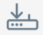
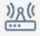
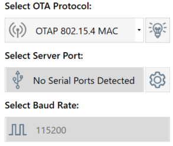

# First Steps

To access related tools, use the [top right panel](#the-top-right-panel).

To begin, perform the following steps:

* Download the SDK from [MCUXpresso](https://mcuxpresso.nxp.com/en/select) (account required).
* Write an OTA server application and OTA client application on two NXP microcontroller platforms?.

> [!IMPORTANT]  
> Use the ***same*** SDK version for building both applications.

To build and flash, perform the following steps:

* Build with IAR or MCUXpresso IDE.
* Flash using Flash Loader (Connectivity Tool Suite) or J-Link Commander. 

**Before attempting an OTA transfer, familiarize yourself with the boards using [_IAR Embedded Workbench IDE_](https://mcuxpresso.nxp.com/mcuxsdk/latest/html/boards/Wireless/k32w148evk/gettingStarted/topics/running_a_demo_application_using_iar.html), [_MCUXpresso IDE_](https://mcuxpresso.nxp.com/mcuxsdk/latest/html/boards/Wireless/k32w148evk/gettingStarted/topics/run_a_demo_using_mcuxpresso_ide.html) or [_MCUXpresso for VS Code_](https://mcuxpresso.nxp.com/mcuxsdk/latest/html/gsd/run_a_demo_using_mcuxvsc.html).**  
The links above refer to the K32W148-EVK board. If you are using a different board, navigate to the __Supported Boards__ menu in the SDK documentation and select the one that matches your setup.

To connect to a device, perform the following steps:
1. Select the communication protocol corresponding to your use-case.
2. To choose the corresponding board with the OTA server application __already__ programmed onto it, use **`Select Server Port`**  from the [serial port panel](#serial-port-panel) .
3. Set the baud rate:  
   1. __Bluetooth LE : 115200__
   2. __Zigbee : 1000000__
   3. __Others : 115200__
4. Click **`Connect to OTAP Server`**.

## The top right panel 

Contains shortcuts to other connectivity tools and more.
 
|    Icon                                                      | Description                |
| ------------------------                                     |--------------              |
|   | Web documentation          |
|             | Firmware Loader            |
|                             | Protocol Analyzer Adapter  |
|         | Windows Device Manager     |
|                    | 'About' window             |

## Serial Port panel

Actions available from this panel:

* To change the protocol, COM port or baud rate, click the corresponding dropdown boxes.
* To view demo steps for each protocol, click the lightbulb icon next to the protocol dropdown box.

[⬅️ Back to Table of Contents](README.md/#table-of-contents)