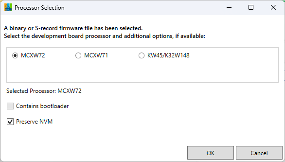
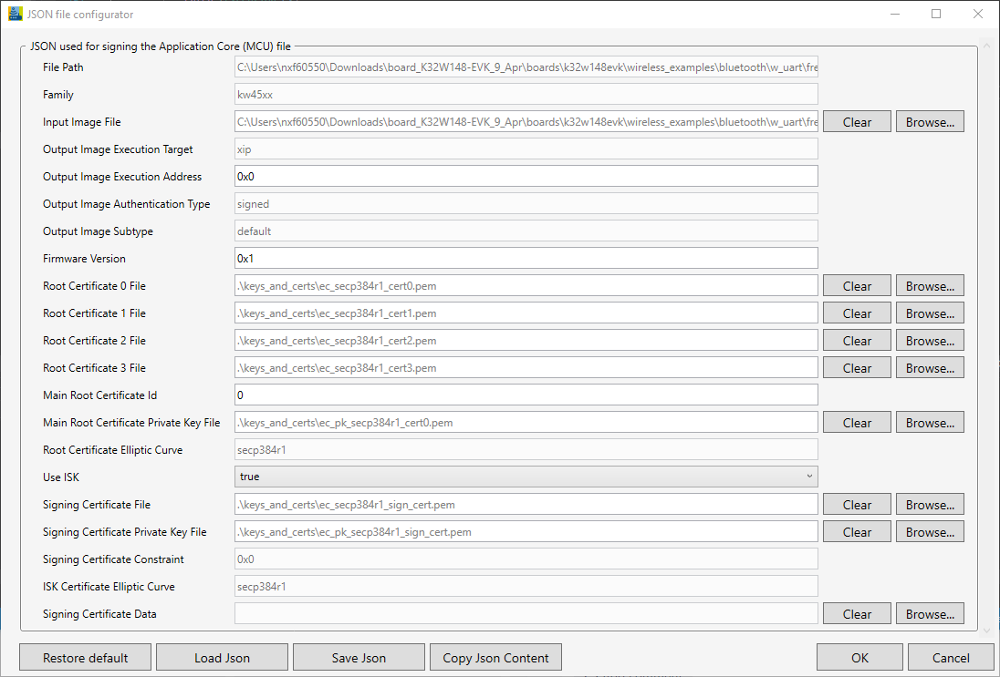
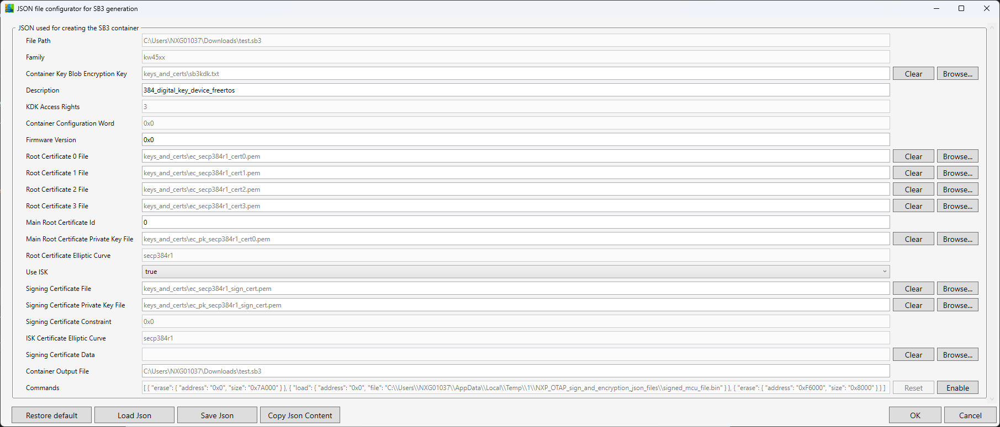
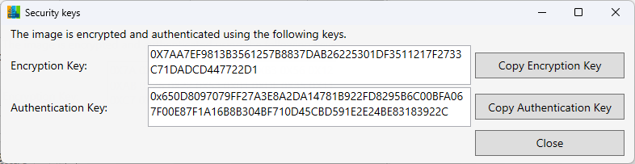

# OTAP Matter

OTAP Matter supports only the generation of a secured SB3 container file for OTA transfer.  
Supported boards:
* K32W148-EVK
* FRDM-MCXW71
* FRDM-MCXW72
* MCXW72-EVK

To generate an `.sb3` file:
1. Add an `.srec`, `.s19`, `.bin` or `.xip` file on the interface via the **`Browse file`** button or by drag & drop.
2. Select the processor.
    
    

    
    

Choose whether to preserve NVM.  
If not, the next window suggests a default NVM erase address, which you can modify.

3. The Images Information window serves multiple purposes:
   - Add an image for the NBU core (usually a `.xip` file).
   - Set start addresses.
   - Optionally, if *preserve NVM* is selected, a panel appears to configure the NVM `start address` and `size`.
   - Change the encryption key (SB3KDK).
   - Enable external flash staging before writing to internal flash.  

          

4. Choose a location and a name for the `.sb3` file to be saved. 

5. Now configure the JSON file for signing the MCU file. For the purpose of this demo, use the [default configuration](https://spsdk.readthedocs.io/en/1.8.0/apps/nxpimage.html#nxpimage-mbi-export).  
For more information on the JSONs used by this application, see [JSON files configuration details](#json-files-configuration-details) chapter.Now configure the JSON file for signing the MCU file. For the purpose of this demo, use the [default configuration](https://spsdk.readthedocs.io/en/1.8.0/apps/nxpimage.html#nxpimage-mbi-export).  
For more information on the JSONs used by this application, see [JSON files configuration details](#json-files-configuration-details) chapter.
    
    

      
    

6. Configure the JSON for the [SB3 container](https://spsdk.readthedocs.io/en/1.8.0/apps/nxpimage.html#nxpimage-sb31-export).
   
    

    
    

    
> [!CAUTION]  
> The "Commands" textbox is auto-completed depending on your input in the previous windows (for example, if you choose to write to the external flash, a command is auto-generated).  
> Modify the Commands field only when necessary, as improper changes can lead to a corrupted `.ota` file.  

7. Review the Encryption Key (SB3KDK) and the Authentication Key (RoTKTH) used for encryption.

For further instructions on how to perform an OTA Matter transfer, see the details provided on [this NXP github page](https://github.com/NXP/matter/tree/v1.0.0.2-tag-nxp/examples/lighting-app/nxp/k32w/k32w1#ota).

### JSON files configuration details

This tool uses SPSDK version 1.8.0.  
For generating the signed MCU file, the [`nxpimage mbi export`](https://spsdk.readthedocs.io/en/1.8.0/apps/nxpimage.html#nxpimage-mbi-export) command is used.  
For creating the encrypted SB3 file, the [`nxpimage sb31 export`](https://spsdk.readthedocs.io/en/1.8.0/apps/nxpimage.html#nxpimage-sb31-export) command is used.  
Three example JSON files are available at: `Over The Air Programming [version]\Secured\json_examples`.  

> [!CAUTION]  
> The encryption key and certificates provided as default are used only for testing purposes. The encryption key and certificates must be replaced when going into production.  

[⬅️ Back to Table of Contents](README.md/#table-of-contents)