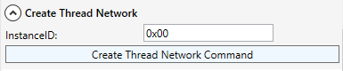
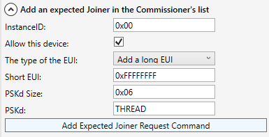
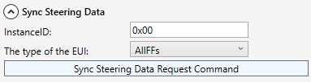
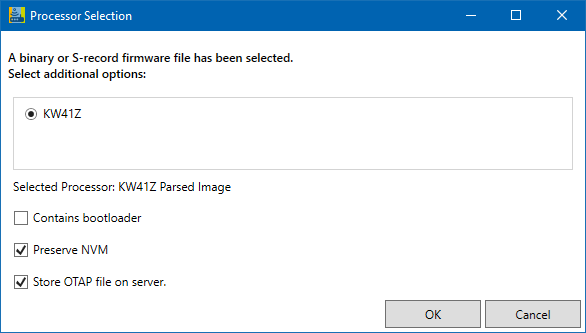

# OTAP Thread

To perform a Thread demo, follow the next steps:

1. Download the Software Development Kit for FRDM-KW41 from [MCUXpresso](https://mcuxpresso.nxp.com/en/select).

2. Write the OTA server application onto the OTAP server device using Firmware Loader.

3. Write the OTA bootloader and OTA client applications onto the OTAP client device using Firmware Loader.

4. Plug in the OTAP server device and click the **`Connect to OTAP Server`** button.

5. Start a new network using the **`Create Thread Network Command`** button.\

6. Start the commissioner using the **`Start Commissioner Request Command `**button.\

7. Add expected joiner using the **`Add Expected Joiner Request Command`** button.\

8. Synchronize steering data using the **`Sync Steering Data Request Command`** button.\

9. Plug in the OTAP client device and press any switch to allow it to join the network.

10. Add the file to be sent OTA using the interface, or simply drag and drop it.

    

11. To start the OTA transfer process, click **`Start OTAP`**.

[⬅️ Back to Table of Contents](README.md/#table-of-contents)