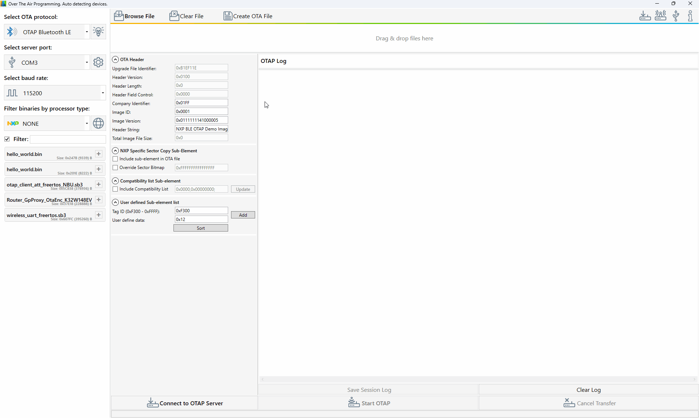

## Plain binary transfers

Below, there is a short gif describing the approach for transferring a plain binary file over-the-air using Bluetooth Low Energy:

  

**Before attempting an OTA transfer, familiarize yourself with the boards using [_IAR Embedded Workbench IDE_](https://mcuxpresso.nxp.com/mcuxsdk/latest/html/boards/Wireless/k32w148evk/gettingStarted/topics/running_a_demo_application_using_iar.html), [_MCUXpresso IDE_](https://mcuxpresso.nxp.com/mcuxsdk/latest/html/boards/Wireless/k32w148evk/gettingStarted/topics/run_a_demo_using_mcuxpresso_ide.html) or [_MCUXpresso for VS Code_](https://mcuxpresso.nxp.com/mcuxsdk/latest/html/gsd/run_a_demo_using_mcuxvsc.html).**  
The links above refer to the K32W148-EVK board. If you are using a different board, navigate to the __Supported Boards__ menu in the SDK documentation and select the one that matches your setup.

To perform a plain binary transfer, follow the next steps:

1. Download the Software Development Kit from the [MCUXpresso](https://mcuxpresso.nxp.com/en/select) website. 

2. Generate a `.bin`, `.srec` or `.s19` file using IAR or MCUXpresso IDEs. 

3. Flash the server application onto the OTA server device.

4. Write the OTA bootloader and the OTAP client application onto the OTA client device. For assistance, check the documentation in the SDK folder you downloaded.

5. To start advertising, press the `ADVSW` button (or the `USER`/`SW4` button) on the OTAP client.

6. To start scanning, press the `SCANSW` button (or the `USER`/`SW4` button) on the OTAP server.

7. Select the COM port corresponding to the server device and connect to it by clicking the **`Connect to OTAP Server`** button.

8. Add a file (`.bin`, `.srec` or `.s19`) to be sent OTA.

9. Select the processor from the "Processor Selection" window that appears.

10. Click the **`Start OTAP`** button and await the transfer start procedure. It can take a few moments.

[⬅️ Back to Bluetooth Low Energy Overview](bluetooth-le.md) 
 
[⬅️ Back to Table of Contents](README.md/#table-of-contents)