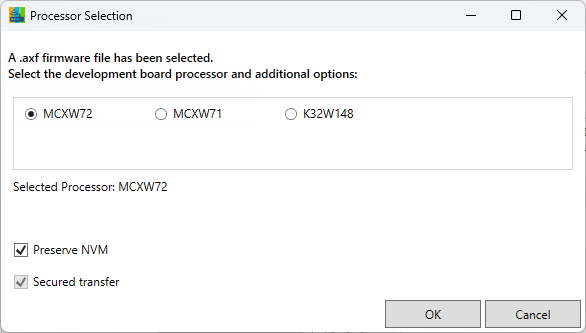
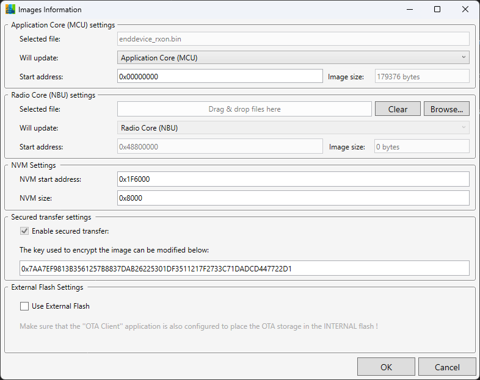
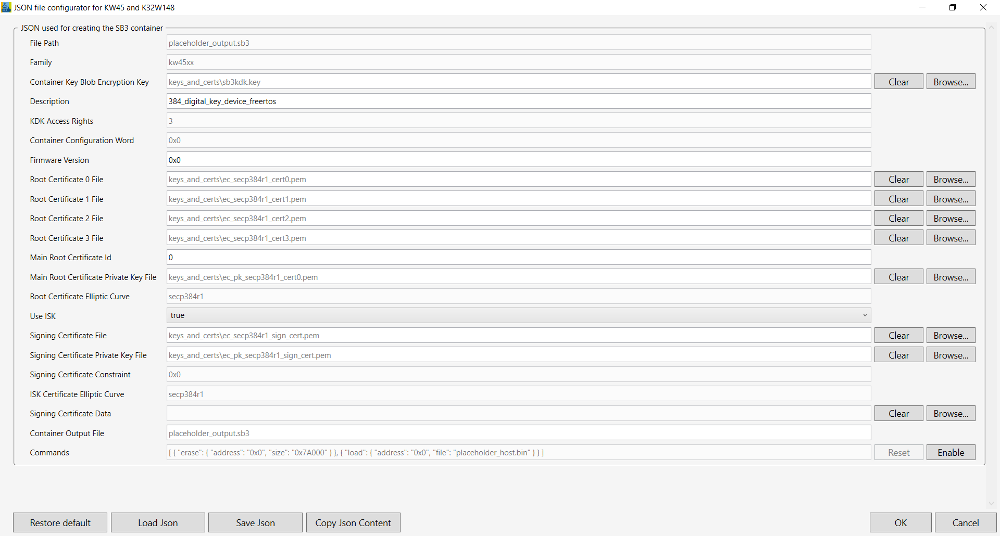
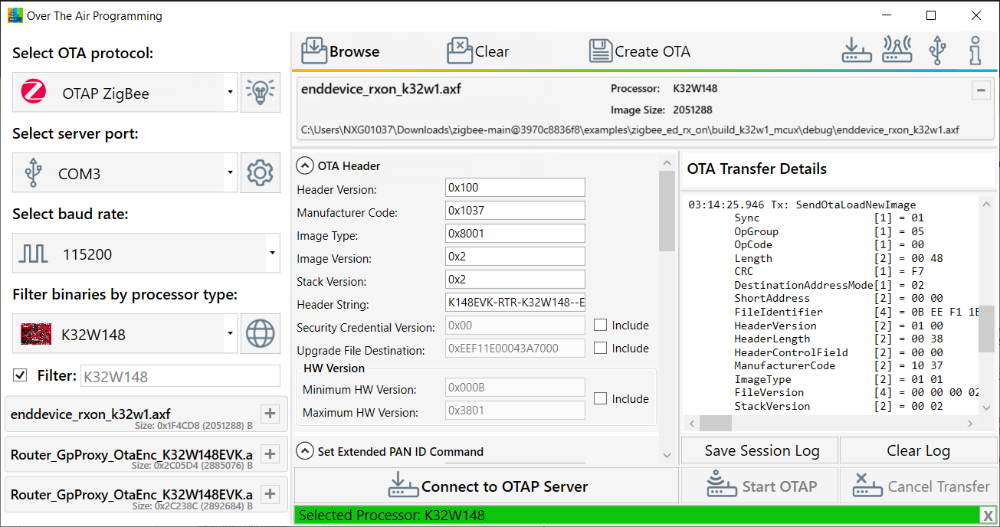

## Creating an `.ota` file from an `.axf` or `.elf` file

Supported devices:
1. FRDM-MCXW72
2. MCXW72-EVK
3. FRDM-MCXW71
4. MCXW71-EVK
5. K32W148-EVK

Steps for creating an `.ota` file from `.axf` or `.elf`:

1. Download the Software Development Kit corresponding to your board from [mcuxpresso.nxp.com](https://mcuxpresso.nxp.com/en/select).

2. Download the [JN-AN-1247 control bridge application note](https://www.nxp.com/webapp/sps/download/license.jsp?colCode=JN-AN-1247) and flash the application onto your board.

3. To build the project for the _router_ application, use the MCUXpresso IDE. It can be found at `[sdk_root]/boards/[your-board]/wireless_examples/zigbee`.

4. In the build directory, both `.ota` and `.elf`/.`axf` files are available. Pick an `.elf`/`.axf` file and drag & drop it into the OTAP tool.

5. A processor selection window appears and you can choose whether or not to preserve the NVM. By default, the NVM is preserved.\

  

6. The Images Information window serves multiple purposes:
   - Add an image for the NBU core (usually a `.xip` file).
   - Set start addresses.
   - Optionally, if *preserve NVM* is selected, a panel appears to configure the NVM `start address` and `size`.
   - Change the encryption key (SB3KDK).
   - Enable external flash staging before writing to internal flash.  

          

7. Now configure the JSON file for signing the MCU file. For the purpose of this demo, use the [default configuration](https://spsdk.readthedocs.io/en/1.8.0/apps/nxpimage.html#nxpimage-mbi-export).  
For more information on the JSONs used by this application, see [JSON files configuration details](#json-files-configuration-details) chapter.

8. Configure the JSON for the [SB3 container](https://spsdk.readthedocs.io/en/1.8.0/apps/nxpimage.html#nxpimage-sb31-export).

> [!CAUTION]  
> The "Commands" textbox is auto-completed depending on your input in the previous windows (for example, if you choose to write to the external flash, a command is auto-generated).  
> Modify the Commands field only when necessary, as improper changes can lead to a corrupted `.ota` file.  
The **Commands** field contains the **placeholder_host.bin** value as it is a temporary file used to generate the SB3.  
The **File Path** value is set to **placeholder_output.sb3** as it is another temporary file used to create the final `.ota` image. The **Container Output File** has the exact value as the **File Path**.  

9. You now have an `.axf` file loaded on the interface and can continue with configuring the OTA header fields. To perform a transfer, an OTA header is necessary.
    

10.   After the header fields are configured, you can proceed to [transferring an `.ota` file over-the-air](zigbee-ota-file-transfer.md#how-to-perform-an-ota-transfer).

### nxpzbota

The OTAP tool uses `nxpzbota.exe` to convert the `.axf`/`.elf` file into a `.bin`, then an `.sb3` and, finally into an `.ota` file.

For that purpose, OTAP collects all the input given by the user in the windows shown and parses it as a command to `nxpzbota.exe`.

This feature is completely optional. The final `.ota` file can either be generated by building the SDK example or, in the case of Application Notes, is already provided as a prebuilt file.  
`nxpzbota.exe` requires ARM GNU Toolchain as prerequisite.

Two example JSON files are available at `Over The Air Programming [version]\Secured\apps\nxpzbota\SB3`. You can use these files as references.

OTAP and the delivered `nxpzbota.exe` use SPSDK version 1.8.0.

### JSON files configuration details

This tool uses SPSDK version 1.8.0.  
For generating the signed MCU file, the [`nxpimage mbi export`](https://spsdk.readthedocs.io/en/1.8.0/apps/nxpimage.html#nxpimage-mbi-export) command is used.  
For creating the encrypted SB3 file, the [`nxpimage sb31 export`](https://spsdk.readthedocs.io/en/1.8.0/apps/nxpimage.html#nxpimage-sb31-export) command is used.  
Three example JSON files are available at: `Over The Air Programming [version]\Secured\json_examples`.  

> [!CAUTION]  
> The encryption key and certificates provided as default are used only for testing purposes. The encryption key and certificates must be replaced when going into production.  

[⬅️ Back to Zigbee Overview](otap-zigbee.md)

[⬅️ Back to Table of Contents](README.md/#table-of-contents)