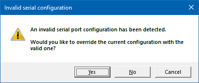
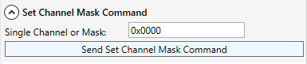
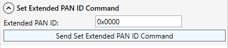
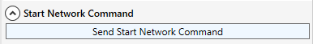
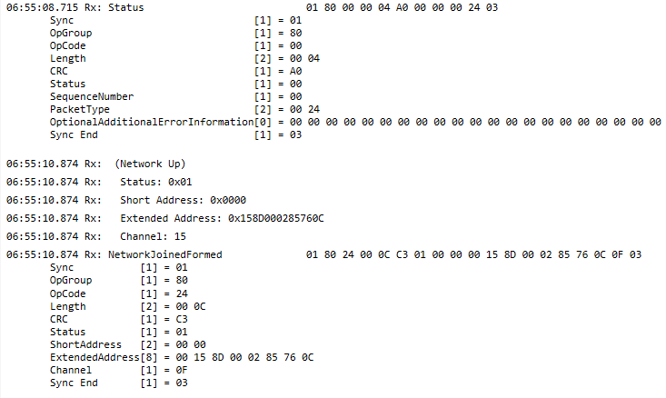
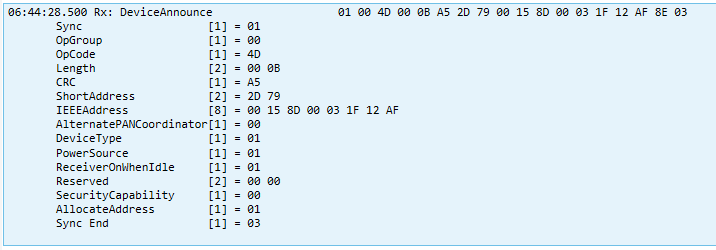
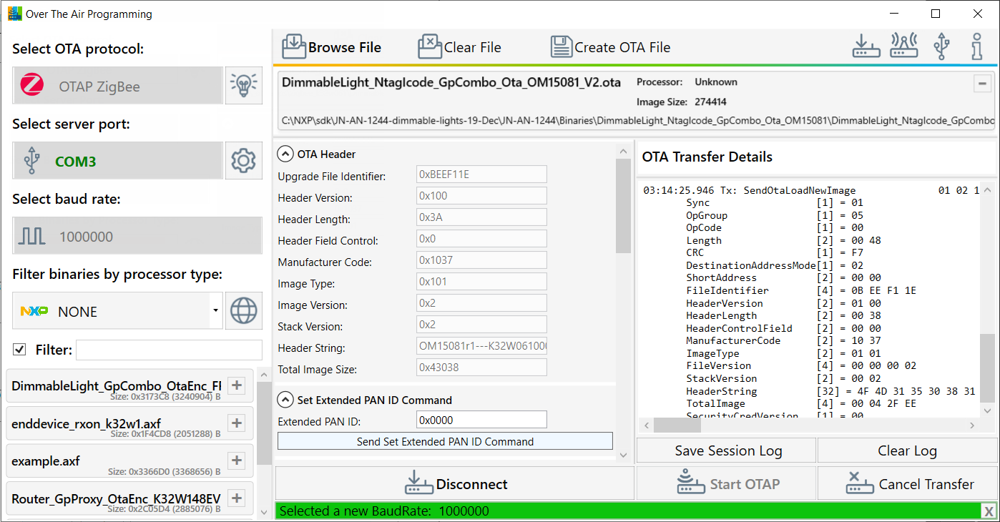

## Sending an `.ota` file over-the-air

This procedure is available for all Zigbee compatible boards.

### Demo suggestion

To create the environment for a demo, perform the next steps:

1. Download the [JN-AN-1247 control bridge application note](https://www.nxp.com/webapp/sps/download/license.jsp?colCode=JN-AN-1247) and use `ControlBridge_Full_GpProxy_1000000_K32W1.bin`.

2. Download the [JN-AN-1244 light bulbs application note](https://www.nxp.com/webapp/sps/download/license.jsp?colCode=JN-AN-1244).
   
3. [Flash](zigbee-ota-file-transfer.md#flashing-the-demo-applications-onto-the-boards) the __control bridge__ binary onto the OTA __server__ using J-Link or any alternative software.

4. [Flash](#flashing-the-demo-applications-onto-the-boards) the __light bulbs__ binary onto the OTA __client__ using J-Link or any alternative software.
> [!TIP]  
> The dimmable light binary used for this demo is: `DimmableLight_NtagIcode_GpCombo_Ota_OM
15081_V1.bin`.

### How to perform an OTA transfer

5. Connect to the OTA server device using the **`Connect to OTAP Server`** button.\
A warning window appears. Ensure you click **`Yes`**.\

  

6. Before starting the transfer, connect the _control bridge_ to the _light bulbs_ device.\
To connect the two devices, perform the following steps:
- Set the channel mask using the **`Send Set Channel Mask Command`** button. This application runs on *channel 11*.

  

  
   
 - Set Extended PAN ID (EPID); usually, this value is `0x0`.

  

- Start a new network using the **`Send Start Network Command`** button.
   

  

As a response to this command, you must see two messages, as show in the figure below.

  

- Pair the two devices using the **`Send Permit Join Command`** button. The conventional addresses are:
   - `0xFFFC` for all Router/Coordinator nodes,
   - `0x0000` for the Coordinator.

- Start the joining process on the OTA client device. This is usually done using `SW4/USER` button on the board. When the client board has successfully connected to the server board, the `Rx: Device Announce` message appears.  
   

  

7.  Add the `.ota` file on the interface and start the transfer by clicking the **`Start OTAP`** button.  

  

### Flashing the demo applications onto the boards
* To flash the demo apps, install MCUXpresso IDE and then install J-Link that comes bundled in the package.
* For K32W148-EVK, MCXW71 and newer boards, you must also flash the NBU (using a specific file for each board) which is located at `SDKPackages\[used-board]\middleware\wireless\ieee-802.15.4\bin\[used-board]\[used-board]_nbu_ble_15_4_dyn.sb3`. 
* NBU flashing is also done using J-Link.
> [!NOTE]  
> For more details on flashing, check the [JN-AN-1260 Zigbee 3.0 Getting Started Application Note](https://www.nxp.com/webapp/sps/download/license.jsp?colCode=JN-AN-1260).

[⬅️ Back to Zigbee Overview](otap-zigbee.md)  

[⬅️ Back to Table of Contents](README.md/#table-of-contents)